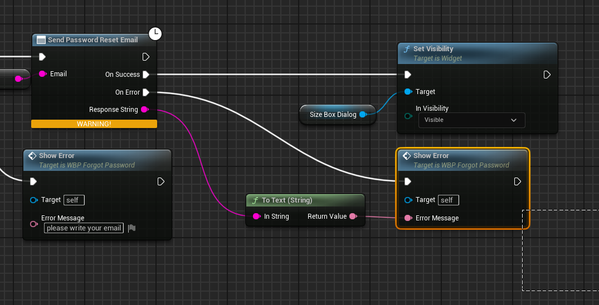
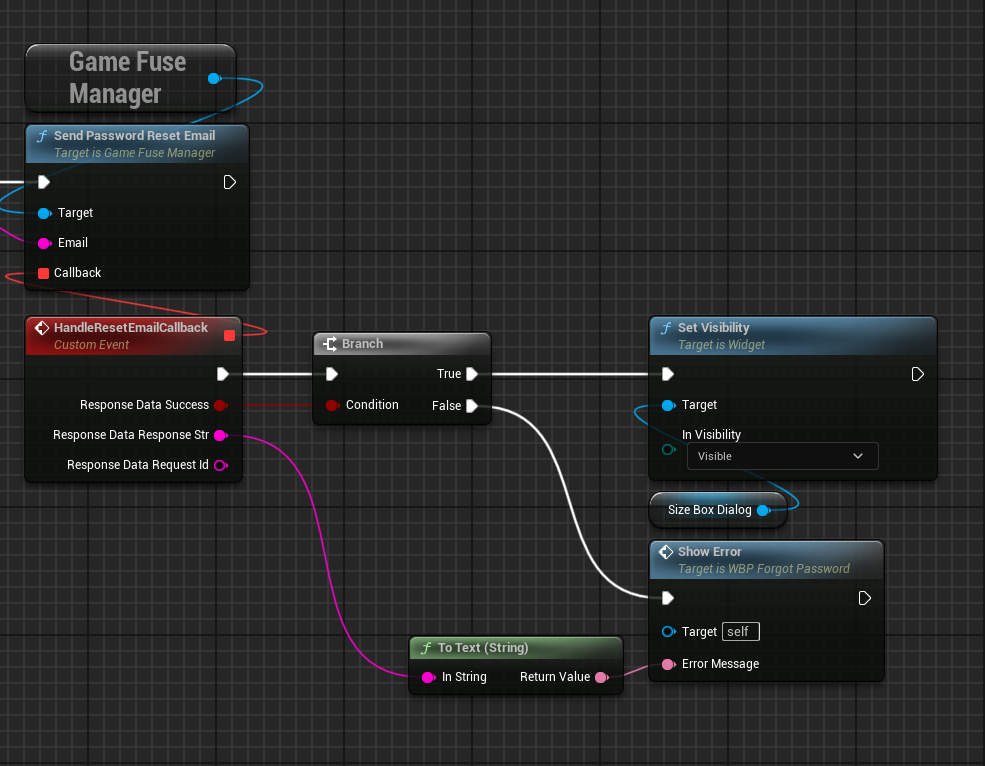
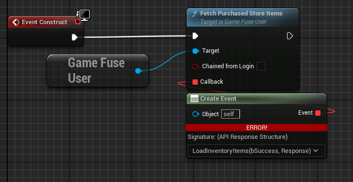
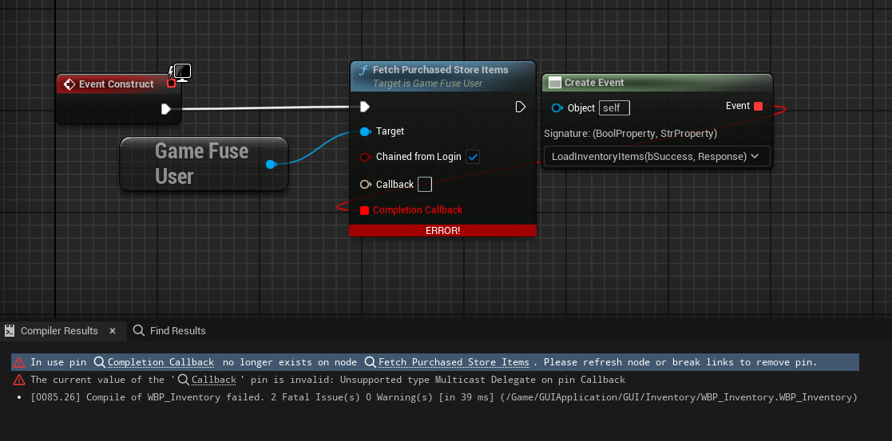
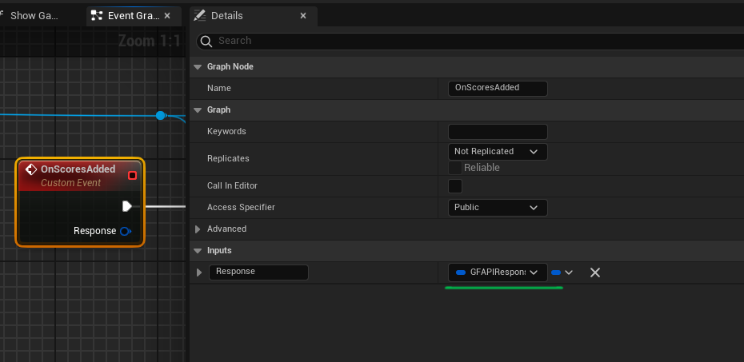
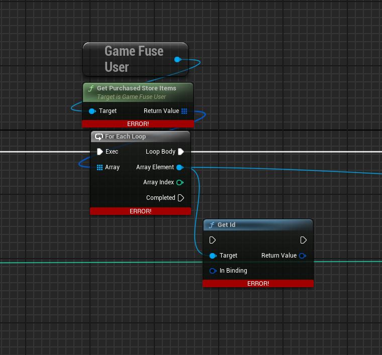
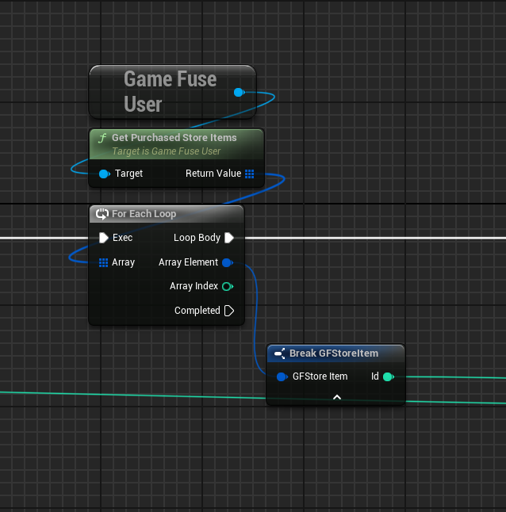

# V2.9 Blueprint Migration Guide

This guide will help you migrate your Blueprint code from GameFuse V2.8 to V2.9. There are several breaking changes in this version that require updates to your existing Blueprint code.

## Getting Started

You should received the update through the Epic Games Launcher, inside `Installed Plugins` under the Launch button.

Start your project and hit play, you will see a list of Blueprint assets that need to be updated. It recommended to open all errored blueprints and work through one blueprint at a time.

### The **TLDR** for this guide
 - compile your blueprints and replace any deprecated functions with their counterpart on the GameFuseManager subsystem.
 - Structs replaced UObjects, your loops need to be refreshed with the new types.
 - Latent nodes have been replaced with delegates, you'll need to bind to them before making API calls. 
 - Any Delegates passed to the API now reply with the FGFAPIResponse struct. Your existing delegate bindings on GameFuseUser need to be updated.

 What follows are some common fixes for the breaking changes in this update.

!!! hint "Splitting Structs"

### Replacing GameFuseCore with GameFuseManager

The `GameFuseCore` class has been deprecated and replaced with the new `GameFuseManager` subsystem.
You should be getting compiler warnings about the deprecated functions. Here's how to update your Blueprint code:

## 1. Latent Node Replacement

All functions that previously returned via latent execution pins (OnSuccess, OnFailure) now use delegates instead. You'll need to bind to these delegates to handle callbacks.

Example for SetUpGame:

Before:

After:

## 2. Event Binding

For handling responses, you'll need to bind to the appropriate delegate before making the API call. You will likely see these warnings related to the GameFuseUser subsystem.

Before:

Setting up the delegate:

The callback signature has changed and now returns the `FGFAPIResponse` struct.
Update your custom event or function with the new signature:

After:

## Working with New Data Structures

### Store Items

Previously, store items were UObjects (`UGameFuseStoreItem`). Now they are structs (`FGFStoreItem`).

Before:

After:

### Leaderboard Entries

These are fixed in the same way as store items.

## Additional Notes

1. All deprecated functions will show warning messages in the Blueprint editor
2. The new struct-based system is more efficient and follows Unreal Engine best practices
3. Direct member access to structs is faster than calling getter functions on UObjects
4. See the example project for complete migration examples: https://github.com/game-fuse/game-fuse-unreal-example

## Common Migration Issues

1. **Compile Errors**: If you see compile errors about missing GameFuseCore, replace with GameFuseManager subsystem
2. **Type Mismatches**: Update any code that expects UObjects to work with the new struct types
3. **Blueprint References**: Update any direct references to GameFuseCore in your Blueprint assets