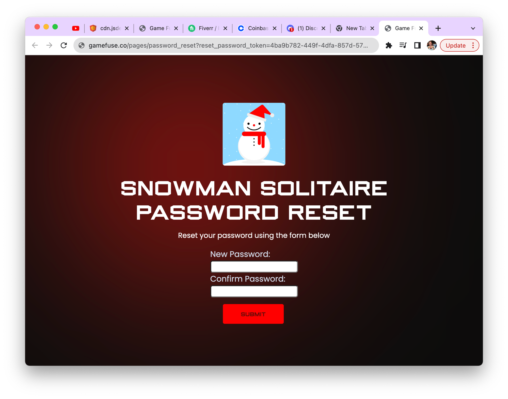

# Forgot Password

You can implement this simple method in your app, and we will handle all the emails and password reset on our end. Once you hit this node, our system will send an email to that user if they exist, branded like your app. It will have your app's name, image logo, and color so it will look cohesive. The sender email is even masked with your app's name. The user will reset their password online and then will be instructed that they can log in to your app.

## User Experience

The user will then receive an email looking like the following:

When the user clicks on the forgot password link, they will see something like:

