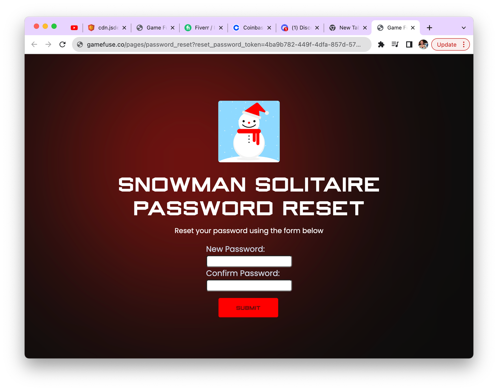

# Forgot password

## User Experience

After executing the API call, the user will receive an email looking like the following

When the user clicks on the forgot password link, they will see something like this

After resetting a password, the user will be notified that they can return to their game and login
